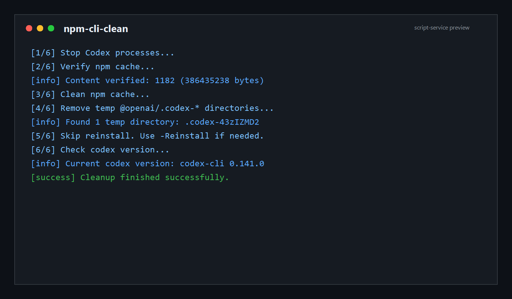
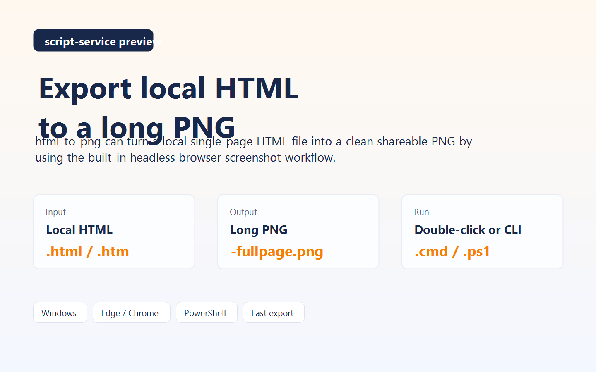
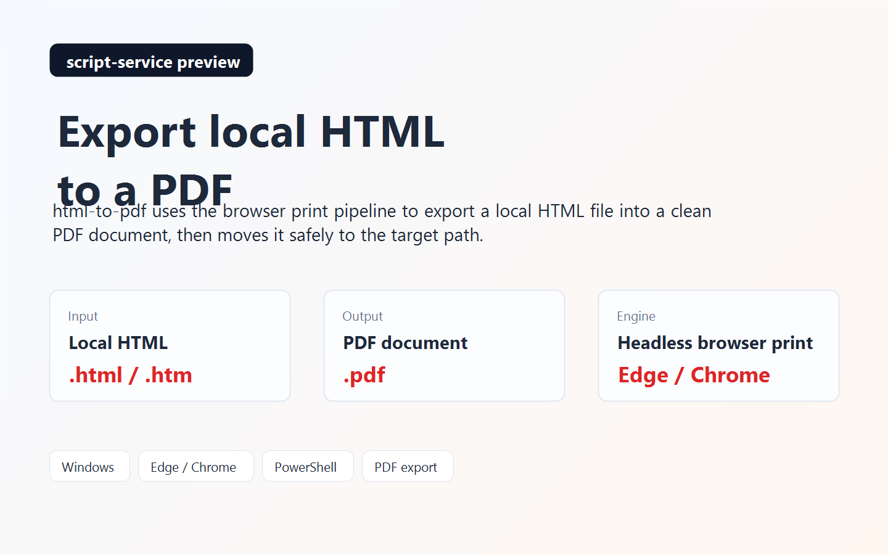
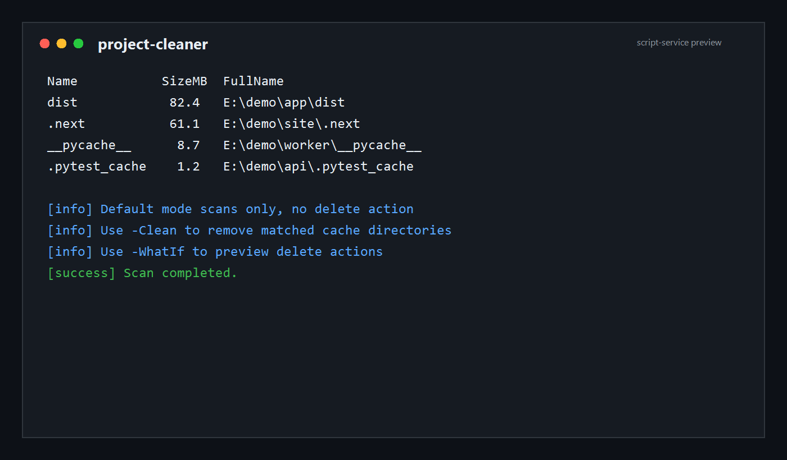

# script-service

个人脚本仓库，用于集中维护各类可复用的 Windows 工具脚本、自动化脚本和开发辅助脚本。
A curated Windows script collection for CLI maintenance, file processing, system cleanup, and developer helpers.

## 维护入口

| 文档 | 作用 |
|---|---|
| [README.md](README.md) | 仓库首页、脚本导航、依赖和状态总览 |
| [RELEASE_GUIDE.md](RELEASE_GUIDE.md) | 发布前检查、更新预览图、新增脚本子项目的维护说明 |
| [CONTRIBUTING.md](CONTRIBUTING.md) | 外部贡献者如何提脚本、修文档、补截图、保持目录结构一致 |
| [tools/generate-readme-previews.ps1](tools/generate-readme-previews.ps1) | 生成根 README 和部分子项目 README 使用的预览图 |

## 快速开始

| 步骤 | 你要做什么 | 建议动作 |
|---|---|---|
| 1 | 先确认你要解决的问题类型 | 先看下方 `脚本分类总表`，判断自己属于 CLI、文件处理、系统维护还是开发辅助 |
| 2 | 找到对应的脚本目录 | 再看 `推荐使用路径` 或 `项目清单`，进入最接近目标的子目录 |
| 3 | 按子项目说明运行 | 优先双击对应 `.cmd` 入口，或按子目录 `README.md` 中的 PowerShell 命令运行 |

## 预览图

| `npm-cli-clean` | `html-to-png` |
|---|---|
|  |  |

| `html-to-pdf` | `project-cleaner` |
|---|---|
|  |  |

## 仓库概览

| 项目 | 说明 |
|---|---|
| 主要收录 | Windows 下可直接运行的 PowerShell / CMD 脚本 |
| 工具类型 | CLI 维护、文件处理、系统维护、开发辅助、自动化脚本 |
| 当前目标 | 结构清晰、可独立使用、带最小文档、尽量减少本机强耦合 |

## 脚本分类总表

| 分类 | 包含项目 | 适用场景 |
|---|---|---|
| CLI | `npm-cli-clean` | 清理 npm 全局 CLI 升级残留、处理 `EPERM` / `unlink` 类报错 |
| 文件处理 | `html-to-png`、`html-to-pdf`、`batch-rename`、`image-batch-convert` | HTML 导出、批量改名、图片格式转换与缩放 |
| 系统维护 | `clean-temp-files`、`folder-size-report`、`port-killer` | 清理临时文件、排查磁盘占用、处理端口占用 |
| 开发辅助 | `project-cleaner`、`port-killer`、`folder-size-report` | 清理项目缓存、定位开发端口冲突、快速查看项目目录体积 |

## 推荐使用路径

| 你的目标 | 建议先看 | 推荐入口 |
|---|---|---|
| 清理 Codex 或其他 npm CLI 升级残留 | `npm-cli-clean/` | `clean-codex-update.cmd` 或 `clean-npm-cli-update.cmd` |
| 把本地 HTML 页面导出为图片 | `html-to-png/` | `open-html-to-png.cmd` |
| 把本地 HTML 页面导出为 PDF | `html-to-pdf/` | `open-html-to-pdf.cmd` |
| 批量修改一批文件名 | `batch-rename/` | `open-batch-rename.cmd` |
| 批量转换图片格式或缩放图片 | `image-batch-convert/` | `open-image-batch-convert.cmd` |
| 查哪个进程占用了某个端口 | `port-killer/` | `open-port-killer.cmd` |
| 快速查看哪个目录最占空间 | `folder-size-report/` | `open-folder-size-report.cmd` |
| 清理 Windows 临时文件 | `clean-temp-files/` | `open-clean-temp-files.cmd` |
| 清理 Node / Python 项目缓存目录 | `project-cleaner/` | `open-project-cleaner.cmd` |

## 项目清单

| 项目 | 说明 | 状态 | 关键依赖 | 文档入口 | 主要入口 |
|---|---|---|---|---|---|
| `npm-cli-clean/` | 清理 Windows 上 npm 全局 CLI 升级残留 | 已验证 | `npm` | [README](npm-cli-clean/README.md) | `clean-codex-update.cmd` / `clean-npm-cli-update.cmd` |
| `html-to-png/` | 将本地 HTML 文件导出为长图 PNG | 已验证 | Edge 或 Chrome | [README](html-to-png/README.md) | `open-html-to-png.cmd` / `html-to-png.ps1` |
| `html-to-pdf/` | 将本地 HTML 文件导出为 PDF | 已验证 | Edge 或 Chrome | [README](html-to-pdf/README.md) | `open-html-to-pdf.cmd` / `html-to-pdf.ps1` |
| `port-killer/` | 查询端口占用并按需结束对应进程 | 已验证 | PowerShell 网络命令 | [README](port-killer/README.md) | `open-port-killer.cmd` / `port-killer.ps1` |
| `folder-size-report/` | 统计子目录大小并排序输出 | 已验证 | PowerShell | [README](folder-size-report/README.md) | `open-folder-size-report.cmd` / `folder-size-report.ps1` |
| `clean-temp-files/` | 清理 Windows 临时目录 | 已验证 | PowerShell | [README](clean-temp-files/README.md) | `open-clean-temp-files.cmd` / `clean-temp-files.ps1` |
| `batch-rename/` | 对文件执行批量重命名 | 已验证 | PowerShell | [README](batch-rename/README.md) | `open-batch-rename.cmd` / `batch-rename.ps1` |
| `image-batch-convert/` | 批量转换 png/jpg/webp 并缩放 | 依赖外部工具 | ImageMagick | [README](image-batch-convert/README.md) | `open-image-batch-convert.cmd` / `image-batch-convert.ps1` |
| `project-cleaner/` | 扫描并清理常见项目缓存目录 | 已验证 | PowerShell | [README](project-cleaner/README.md) | `open-project-cleaner.cmd` / `project-cleaner.ps1` |

## 推荐脚本

| 项目 | 推荐原因 |
|---|---|
| `npm-cli-clean/` | 结构最完整，包含交互菜单、配置文件、风险边界和日志机制 |
| `html-to-png/` | 适合快速导出本地 HTML 长图，使用门槛低 |
| `port-killer/` | 开发场景高频实用，定位明确 |
| `project-cleaner/` | 对 Node / Python 项目维护很有帮助 |

| 项目 | 代表能力 |
|---|---|
| `npm-cli-clean/` | Codex 一键清理、通用 npm CLI 交互式清理、状态检测、配置化工具清单 |
| `html-to-png/` | GUI 选择本地 HTML 文件、命令行导出 PNG、自动检测 Edge / Chrome |
| `html-to-pdf/` | 本地 HTML 快速导出 PDF，兼容中文路径输出 |
| `project-cleaner/` | 常见 Node / Python 缓存目录扫描与安全预览删除 |

## 仓库规范

| 约定项 | 说明 |
|---|---|
| `README.md` | 说明脚本用途、适用范围、风险边界和使用方法 |
| `LICENSE` | 许可证 |
| `VERSION` | 当前版本号 |
| `CHANGELOG.md` | 版本变更记录 |
| 主脚本文件 | 例如 `.ps1`、`.cmd`、`.bat`、`.py` |
| 可选配置文件 | 例如 `tools.json`、`config.json` |
| 目录原则 | 一个子目录解决一类相对独立的问题 |
| 维护原则 | 优先保持可单独复制使用，尽量减少固定路径依赖 |
| 安全原则 | 高风险逻辑优先支持预览模式或最小验证 |

## 使用方式

| 场景 | 建议 |
|---|---|
| 只关心 CLI 清理 | 进入 `npm-cli-clean/` |
| 只关心 HTML 导出 | 进入 `html-to-png/` 或 `html-to-pdf/` |
| 只关心系统维护 | 优先看 `clean-temp-files/`、`port-killer/`、`folder-size-report/` |
| 只关心批量处理 | 优先看 `batch-rename/`、`image-batch-convert/` |
| 继续扩展仓库 | 建议按主题增加独立子目录，例如 `pdf-tools/`、`system-tools/`、`dev-helpers/`、`network-tools/` |

## 依赖与说明

| 项目 | 说明 |
|---|---|
| 平台优先级 | 当前仓库优先面向 Windows |
| 状态说明 | `已验证` 表示已在本机完成基本运行验证；`依赖外部工具` 表示脚本本身可用，但需要额外安装依赖 |
| 详细边界 | 各子目录的依赖、边界和风险说明应在各自 `README.md` 中维护 |

| 依赖项 | 用到的项目 | 说明 |
|---|---|---|
| `PowerShell` | 全部项目 | 基础运行环境 |
| `npm` / Node.js | `npm-cli-clean` | 用于检测、清理和可选重装 npm 全局 CLI |
| Edge 或 Chrome | `html-to-png`、`html-to-pdf` | 使用浏览器无头截图或无头打印能力 |
| ImageMagick | `image-batch-convert` | 用于图片格式转换和缩放 |
| Windows 网络命令 | `port-killer` | 使用 `Get-NetTCPConnection`、`Get-Process` 等系统命令 |

## 计划方向

| 方向 | 说明 |
|---|---|
| 新增脚本 | 持续补充新的脚本子目录 |
| 文档统一 | 继续统一各子项目 README 结构 |
| 发布完善 | 为可公开复用的脚本补充版本号、许可证和变更记录 |
